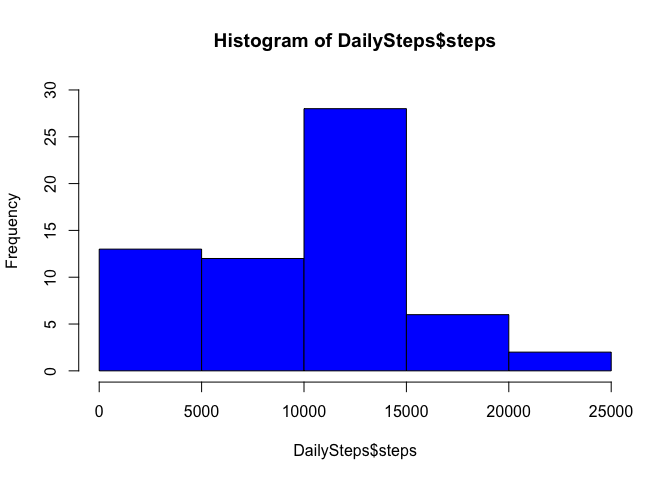
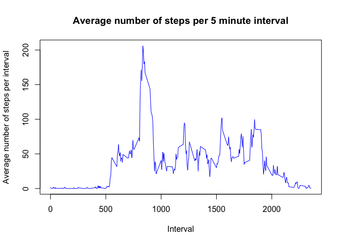
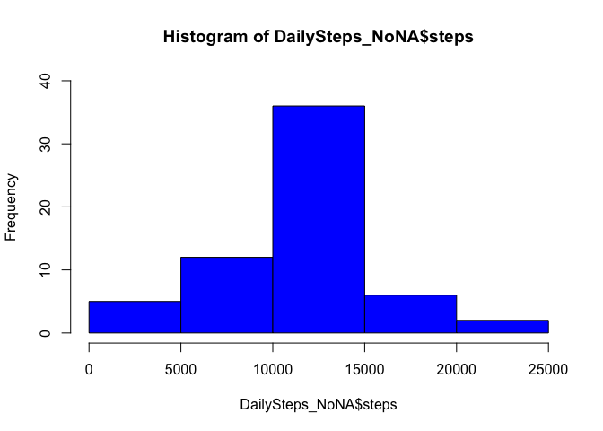
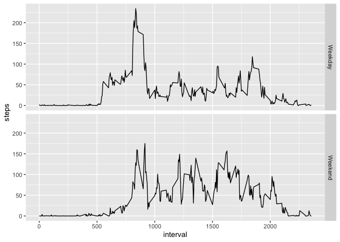

## Loading and preprocessing the data
1. Unzipping activity file and reading its content

```r
unzip("./activity.zip")
activity <- read.csv("./activity.csv")
```

2. Loading required packages

```r
library(dplyr)
```

```
## 
## Attaching package: 'dplyr'
```

```
## The following objects are masked from 'package:stats':
## 
##     filter, lag
```

```
## The following objects are masked from 'package:base':
## 
##     intersect, setdiff, setequal, union
```

```r
library(ggplot2)
```

## What is mean total number of steps taken per day?
1. Calculate the total number of steps taken per day. 

```r
# Finding total steps per day 
DailySteps <- summarise(group_by(activity, date), steps = sum(steps, na.rm = TRUE))
```

```
## `summarise()` ungrouping output (override with `.groups` argument)
```

2. Make a histogram of the total number of steps taken each day

```r
# histogram of daily steps
hist(DailySteps$steps, col = "blue", ylim = c(0, 30))
```

<!-- -->

3. Calculate and report the mean and median of the total number of steps taken per day

```r
# Calculating mean steps per day
m <- mean(DailySteps$steps)
# Printing mean
m
```

```
## [1] 9354.23
```


```r
# Calculating median steps per day
med <- median(DailySteps$steps)
# Printing median
med
```

```
## [1] 10395
```

## What is the average daily activity pattern?
1. Make a time series plot (i.e. \color{red}{\verb|type = "l"|}type = "l") of the 5-minute interval (x-axis) and the average number of steps taken, averaged across all days (y-axis)

```r
# Finding mean steps per interval
IntervalSteps <- summarise(group_by(activity, interval), steps = mean(steps, na.rm = TRUE))
```

```
## `summarise()` ungrouping output (override with `.groups` argument)
```

```r
# Plotting mean number of steps per 5 minute interval
plot(y = IntervalSteps$steps, x = IntervalSteps$interval, col = "blue", xlab = "Interval", ylab = "Average number of steps per interval", main = "Average number of steps per 5 minute interval", type = "l")
```

<!-- -->

2. Which 5-minute interval, on average across all the days in the dataset, contains the maximum number of steps?

```r
# Finding interval containing maximum number of steps 
InervalMaxSteps <- IntervalSteps[which.max(IntervalSteps$steps), ]$interval
# Printing this interval
InervalMaxSteps
```

```
## [1] 835
```

## Imputing missing values
1. Calculate and report the total number of missing values in the dataset (i.e. the total number of rows with \color{red}{\verb|NA|}NAs)

```r
# Finding sum of missing values in original dataset
NAs <- sum(is.na(activity))
# Printing number of missing values
NAs
```

```
## [1] 2304
```

2. Devise a strategy for filling in all of the missing values in the dataset. The strategy does not need to be sophisticated. For example, you could use the mean/median for that day, or the mean for that 5-minute interval, etc.

```r
MeanPerInterval <- function(interval) {
        IntervalSteps[IntervalSteps$interval==interval, ]$steps
}
```

3. Create a new dataset that is equal to the original dataset but with the missing data filled in.

```r
# Creating new dataset
NaReplace <- activity
# Transforming values in Steps column from integer to numeric 
NaReplace$steps <- as.numeric(NaReplace$steps)
# Replacing all Na's with the mean of that interval
for(i in 1:nrow(NaReplace)) {
        if(is.na(NaReplace[i, ]$steps)) {
                NaReplace[i, ]$steps <- MeanPerInterval(NaReplace[i, ]$interval)
        }
}
```

4. Make a histogram of the total number of steps taken each day and Calculate and report the mean and median total number of steps taken per day. Do these values differ from the estimates from the first part of the assignment? What is the impact of imputing missing data on the estimates of the total daily number of steps?

```r
# Finding sum of steps per day 
DailySteps_NoNA <- summarise(group_by(NaReplace, date), steps = sum(steps))
```

```
## `summarise()` ungrouping output (override with `.groups` argument)
```

```r
# Plotting Histogram of daily steps
hist(DailySteps_NoNA$steps, col = "blue", ylim = c(0, 40))
```

<!-- -->


```r
m_NoNA <- mean(DailySteps_NoNA$steps)
m_NoNA
```

```
## [1] 10766.19
```


```r
med_NoNA <- median(DailySteps_NoNA$steps)
med_NoNA
```

```
## [1] 10766.19
```

It appears that both the mean and the median have changed. What is interesting is that both the median and the mean now have the same value. 

## Are there differences in activity patterns between weekdays and weekends?
1. Create a new factor variable in the dataset with two levels – “weekday” and “weekend” indicating whether a given date is a weekday or weekend day.

```r
activity$date <- as.Date(activity$date)
activity$day <- weekdays(activity$date)

for(i in 1:nrow(activity)) {
        if(activity[i, ]$day %in% c("Saturday", "Sunday")) {
                activity[i,]$day <- "Weekend"
        }
        else {
        activity[i,]$day <- "Weekday"
        }
}

DailySteps_Weekdays <- summarise(group_by(activity, day, interval), steps = mean(steps, na.rm = TRUE))
```

```
## `summarise()` regrouping output by 'day' (override with `.groups` argument)
```

2. Make a panel plot containing a time series plot (i.e. \color{red}{\verb|type = "l"|}type = "l") of the 5-minute interval (x-axis) and the average number of steps taken, averaged across all weekday days or weekend days (y-axis). See the README file in the GitHub repository to see an example of what this plot should look like using simulated data.

```r
ggplot(DailySteps_Weekdays, aes(x = interval, y = steps)) +
        geom_line() +
        facet_grid(day ~.,)
```

<!-- -->
